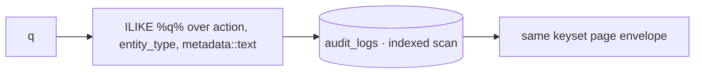
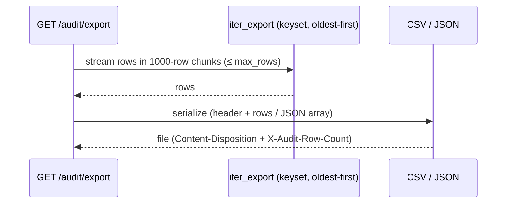
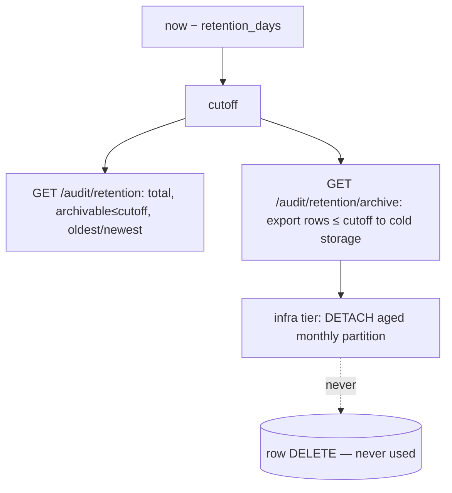

# Audit Logging Service (Sprint 2 · S2-T6)

A read-only query/search/export layer over the append-only `audit_logs` table that every module already
writes to. The service issues **no INSERT, UPDATE, or DELETE** — the DB immutability trigger and the
append-only grants enforce that independently. There is **no migration**: the table and its indexes
(`(organization_id, created_at DESC)`, `actor_user_id`, `(entity_type, entity_id)`, `action`) already
exist from S2-T1.

## Components

| Concern | Location |
|---|---|
| Read-only ORM mapping | `audit/models.py` |
| Filters, keyset pagination, export iterator, retention counts | `audit/repository.py` |
| Query / timeline / export / retention services + cursors | `audit/service.py` |
| Query, search, timeline, actor/entity, export, retention, platform feed | `audit/router.py` |

## Tenancy & authorization

Every tenant route runs on `get_tenant_session` (RLS), so the active org is the only org a query can
see — tenancy is enforced by the database, not by application filters. Every route is gated by
`require_permission("audit:read")` (Org Admin and Super Admin hold it; Manager/Member do not). The
platform feed of org-NULL events runs on the identity session behind
`require_platform_permission("org:provision")`.

## Audit query flow

```mermaid
flowchart TD
    A[GET /audit/logs + filters] --> P[require_permission audit:read]
    P --> S[get_tenant_session · RLS = active org]
    S --> F[build WHERE: action / entity / actor / date / search]
    F --> C{cursor?}
    C -- yes --> K[keyset: created_at,id < cursor]
    C -- no --> O[first page]
    K --> Q[ORDER BY created_at DESC, id DESC LIMIT n+1]
    O --> Q
    Q --> R[items + next_cursor (+ total if requested)]
```

Filters compose: `action` (exact) or `action_prefix`, `entity_type`, `entity_id`, `actor_user_id`,
`date_from`/`date_to`, and `q` (free-text). Actor tracking (`/audit/actors/{id}`) and entity tracking
(`/audit/entities/{type}/{id}`) are the same engine with a pinned filter — entity history is returned
**ascending** so it reads as the lifecycle of one record. The timeline groups a page into per-day
buckets.

## Pagination (keyset)

Cursors are opaque base64 of `{created_at}|{id}`. Paging compares `(created_at, id)` against the cursor
rather than using OFFSET, so pagination stays O(log n) and stable even as new rows are appended — the
right shape for an ever-growing log. `include_total=true` adds a COUNT for UIs that need it; it is
opt-in because COUNT is the expensive part. An invalid cursor is a 422.

## Search flow



Search is a case-insensitive match across `action`, `entity_type`, and the `metadata` JSON serialized to
text, returned through the same paginated envelope. At current scale the existing btree indexes plus
ILIKE are sufficient; a `pg_trgm` GIN index on `action`/`entity_type` (and a JSONB path index for hot
metadata keys) is the documented next step if search volume grows.

## Export flow



`iter_export` is a keyset-driven async generator bounded by `audit_export_max_rows` (50k). The same pure
builder is what a background worker would call — **async-ready**: for large exports the design enqueues a
job, a worker streams `iter_export` to object storage, and the API hands back a signed URL. The
synchronous endpoint uses the identical path for small exports and returns the file inline (csv or json).

## Retention strategy



Retention is **archival, never deletion** — which is the only model compatible with an immutable log.
`/audit/retention` previews how many records fall past the window; `/audit/retention/archive` exports
those records (cold-storage handoff). Physical reclamation is delegated to the infrastructure tier via
monthly RANGE partitioning: a fully-archived month is `DETACH`ed (DDL), never row-deleted, so live rows
remain immutable. Partitioning is the recommended production rollout and is intentionally **not** applied
as a live-table rewrite in this task. Config: `audit_retention_days` (365), `audit_export_max_rows`,
`audit_default_page_size` (50), `audit_max_page_size` (100).

## Endpoints

| Method | Path | Permission | Purpose |
|---|---|---|---|
| GET | `/audit/logs` | audit:read | Query with filters + pagination |
| GET | `/audit/search` | audit:read | Free-text search |
| GET | `/audit/timeline` | audit:read | Per-day grouped events |
| GET | `/audit/actors/{actor_user_id}` | audit:read | Actor tracking |
| GET | `/audit/entities/{entity_type}/{entity_id}` | audit:read | Entity history (chronological) |
| GET | `/audit/export` | audit:read | CSV/JSON export |
| GET | `/audit/retention` | audit:read | Retention preview |
| GET | `/audit/retention/archive` | audit:read | Archival export past the window |
| GET | `/audit/platform/logs` | org:provision (platform) | Org-NULL platform events |

## Rules honored

Immutable / no UPDATE / no DELETE — the service is GET-only and never mutates ✓; access is
permission-protected (`audit:read`) ✓; all tenant queries respect tenancy via RLS ✓; export is
async-ready (bounded keyset generator, worker-portable) ✓; pagination supported (keyset cursors) ✓.

## Verification

**21/21** e2e against live PostgreSQL + Redis: query + total, descending order, action filter, entity
history (assigned→removed), actor history, search, timeline buckets, keyset pagination (limit/cursor,
bad cursor → 422), CSV + JSON export with row-count header, retention preview (archivable=0, policy
forbids DELETE), `audit:read` enforcement (403), tenancy isolation (org2 events invisible to org1),
platform feed (org-NULL grant visible to platform admin, hidden from the tenant feed), and the audit API
being GET-only. Regression green: auth 18/18, tenancy 11/11, orgs 19/19, rbac 20/20, RLS suite 34/34,
unit 2/2.
