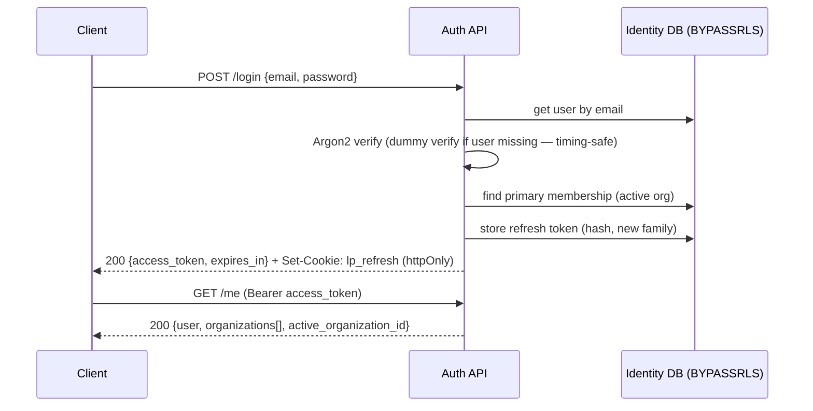

# Authentication Service (Sprint 2 · S2-T2)

Identity-plane auth for the platform. Backend only — no org switching, no RBAC enforcement, no frontend.

## Endpoints

| Method | Path | Auth | Purpose |
|---|---|---|---|
| POST | `/api/v1/auth/register` | public | Path A — self-service: create org + user + Org Admin membership, sign in |
| POST | `/api/v1/auth/provision` | provisioning key | Path B — Super-Admin provisioning of an org + admin |
| POST | `/api/v1/auth/login` | public | Email + password → access JWT + refresh cookie |
| POST | `/api/v1/auth/refresh` | refresh cookie | Rotate refresh token, issue new access JWT |
| POST | `/api/v1/auth/logout` | refresh cookie | Revoke the refresh family, clear cookie |
| POST | `/api/v1/auth/password-reset/request` | public | Issue a reset link (always 202; no enumeration) |
| POST | `/api/v1/auth/password-reset/confirm` | reset token | Set new password, revoke all sessions |
| POST | `/api/v1/auth/email/verify` | verify token | Mark email verified |
| POST | `/api/v1/auth/email/verify/resend` | public | Re-issue a verification link (always 202) |
| GET | `/api/v1/auth/me` | access JWT | Current user + memberships + active org |

## Authentication flow (login)



## Refresh rotation + reuse detection

```mermaid
sequenceDiagram
    participant C as Client
    participant API as Auth API
    participant DB as Identity DB
    C->>API: POST /refresh (cookie R1)
    API->>DB: lookup hash(R1)
    alt R1 valid & unused
        API->>DB: create R2 (same family); mark R1 rotated+revoked, replaced_by=R2
        API-->>C: 200 {new access} + Set-Cookie R2
    else R1 already rotated/revoked (theft replay)
        API->>DB: revoke ENTIRE family (reuse_detected)
        API-->>C: 401 — and R2 is now dead too
    else R1 expired / unknown
        API-->>C: 401
    end
```

This is the standard refresh-token-rotation defence: every refresh consumes the presented token and
issues a new one in the same family. Replaying a consumed token signals theft, so the whole family is
revoked — proven in tests (replay R1 → 401, then R2 → 401).

## Token lifecycle

| Token | Form | Lifetime | Storage | Transport |
|---|---|---|---|---|
| Access | JWT HS256 (`sub`, `org`, `jti`, `type`, `exp`) | 15 min | none (stateless) | `Authorization: Bearer` |
| Refresh | 48-byte opaque, SHA-256 hashed at rest | 30 days, rotated each use | `auth_refresh_tokens` | httpOnly/Secure/SameSite cookie, path `/api/v1/auth` |
| Email verification | 32-byte opaque, hashed | 48 h, single-use | `auth_tokens` | link (logged in S2; emailed later) |
| Password reset | 32-byte opaque, hashed | 30 min, single-use | `auth_tokens` | link (logged in S2; emailed later) |

The `org` claim is the user's **primary** org for now; the org-switch endpoint (later in Sprint 2)
will re-mint the access token with a different active org.

## Security model & protections

- **Argon2** password hashing (`argon2-cffi`), with automatic rehash-on-login when parameters change.
- **Refresh rotation + family reuse detection** — token theft revokes the whole family.
- **Tokens stored only as SHA-256 hashes**; raw tokens never persisted or logged (only verification/reset
  links are logged, and that is replaced by real email delivery later).
- **httpOnly / Secure / SameSite** refresh cookie scoped to the auth path; access token is short-lived.
- **No account enumeration** — password-reset and resend always return 202; login returns a generic 401
  and runs a dummy Argon2 verify when the user is missing (timing-safe).
- **Identity plane is privileged, isolated** — auth runs on a BYPASSRLS session because it operates
  before/around org context; all tenant business data continues to use the RLS-enforced `app_user`
  session. Auth/token tables carry no `organization_id` and are never exposed by the API.
- **Provisioning gate** — `/provision` requires `X-Provisioning-Key` until the Super Admin permission
  replaces it in S2-T5.
- **Password reset revokes all sessions** for the user (forces re-login everywhere).

> Rate limiting and brute-force lockout are intentionally deferred to **S2-T8 (security hardening)**.
> RBAC authorization (`require_permission`) is **S2-T5** — `/me` here returns memberships but enforces
> no permissions. Auth tables are identity-plane, so they are correctly **excluded** from the org-RLS
> verification harness.

## Verification

A full end-to-end run against live PostgreSQL exercised all flows — **18/18 checks**: register→/me,
email verify, login, refresh rotation, reuse detection + family revocation, bad-password 401, reset
request→confirm→login, provisioning gate (403 without key / 201 invited with key), duplicate-email 409,
and logout. The RLS suite (34 tests) and unit tests remain green.
