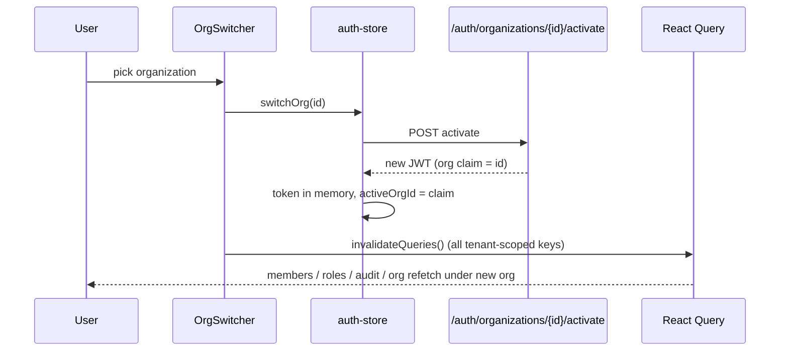
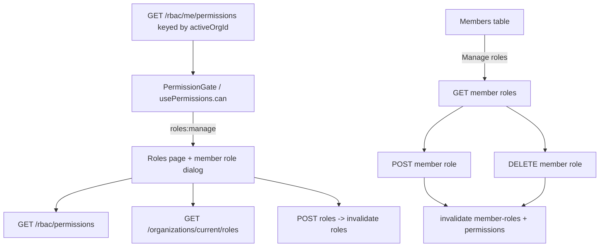

# Frontend — Auth & Admin Module (Sprint 2 · S2-T7)

The Next.js 15 frontend for the secure core: authentication flows, the organization switcher, and the
admin surfaces (profile, organization, members, invitations, roles, audit). It consumes the existing
Auth, Tenancy, RBAC, and Audit APIs unchanged. Stack: Next.js 15 App Router, ShadCN (new-york), React
Query, Zustand, and the established indigo/slate design tokens.

## Session architecture

The access token (15-minute lifetime) lives **only in memory** (Zustand) — never `localStorage` — so a
stolen disk or XSS-readable store can't lift a long-lived credential. The refresh token is an httpOnly
cookie owned by the backend. Consequences that shape the whole module:

- **Silent refresh on boot.** A page load starts with no token (memory is empty), so `SessionProvider`
  calls `/auth/refresh` once on mount; the cookie mints a fresh access token and the session hydrates
  (`me` + `organizations`). Until that resolves, status is `loading`.
- **Single-flight 401 refresh.** The API client injects `Authorization: Bearer` and, on a 401, runs one
  shared refresh and retries; concurrent 401s await the same round-trip. If refresh fails, the
  unauthorized handler resets state and routes to `/login`.
- **Client-side route protection.** A server middleware can't see an in-memory token, so the `(app)`
  group is wrapped in `AuthGuard`: it waits for the bootstrap, admits authenticated users, and redirects
  everyone else to `/login`. The `(auth)` group does the inverse — authenticated users are bounced to
  `/dashboard`.
- **Active org = a JWT claim.** Switching orgs mints a new token server-side; the active org id is read
  from the token's `org` claim, and every tenant-scoped React Query key includes it, so a switch
  refetches cleanly.

## Generated files

API clients (`src/lib/api/`): `client.ts` (token injection + single-flight refresh + `apiUrl`),
`types.ts`, `auth.ts`, `organizations.ts`, `rbac.ts`, `audit.ts`.

State (`src/stores/auth-store.ts`): Zustand store — token, user, active org, organizations, status, and
the `bootstrap/login/register/refresh/switchOrg/logout` actions. Session wiring in
`src/features/auth/` (`session-provider.tsx`, `use-session.ts` with `useSwitchOrg`/`useLogout`).

Hooks (`src/hooks/`): `use-permissions` (gating), `use-organizations`, `use-members`,
`use-invitations`, `use-rbac`, `use-audit` (incl. infinite query for the log).

Components: `src/components/auth/` (auth-card, login/register/reset/verify/resend forms, accept-invite,
`auth-guard`, `permission-gate`); `src/components/shell/` (real org-switcher + user-menu);
`src/components/organizations/`, `members/`, `invitations/`, `rbac/`, `audit/`. Added ShadCN primitives:
card, label, badge, table, textarea, alert, tabs, select, switch, sonner.

Pages — `(auth)` group: `/login`, `/register`, `/forgot-password`, `/reset-password`, `/verify-email`,
`/resend-verification`, `/invite/[token]`. `(app)` group: `/profile`, `/settings/organization`,
`/settings/members`, `/settings/invitations`, `/settings/roles`, `/audit`.

## Page structure

```
app/
├─ (auth)/                 centered split-panel, redirects authed → /dashboard
│  ├─ login · register · forgot-password · reset-password
│  ├─ verify-email · resend-verification
│  └─ invite/[token]       invitation preview + accept
└─ (app)/                  AuthGuard → AppShell (sidebar + top nav + org switcher)
   ├─ dashboard
   ├─ profile
   ├─ settings/organization   profile + settings
   ├─ settings/members        members table + role dialog
   ├─ settings/invitations    invite + pending list
   ├─ settings/roles          roles + permission catalog + create role
   └─ audit                   filters + infinite table + CSV/JSON export
```

## Auth flow

```mermaid
flowchart TD
    Boot[App load] --> SP[SessionProvider: POST /auth/refresh]
    SP -->|ok| Hydrate[token in memory + GET /auth/me + GET /organizations] --> Authed[status=authenticated]
    SP -->|fail| Anon[status=anonymous]
    Anon --> Login[/login: POST /auth/login/] --> Hydrate
    Authed --> Guard{AuthGuard}
    Guard -->|authenticated| App[render app]
    Anon -->|on (app) route| Redirect[redirect /login]
    App -->|401 on any call| Refresh[single-flight POST /auth/refresh]
    Refresh -->|ok| Retry[retry request] --> App
    Refresh -->|fail| Redirect
```

Registration mirrors login (`POST /auth/register` → hydrate → `/dashboard`). Password reset is
request → email → `/reset-password?token=` → confirm → `/login`. Email verification auto-runs on
`/verify-email?token=` mount; failures route to resend. The reset-confirm and verify pages read the
token via `useSearchParams` inside a Suspense boundary (Next 15 requirement).

## Organization switch flow



## RBAC management flow



`PermissionGate` only hides controls the user couldn't use anyway — the backend re-checks every request,
so gating is a UX affordance, not the security boundary. Assigning or removing a role invalidates both
that member's roles and the current user's permissions, so the UI re-gates immediately.

## Validation

`tsc --noEmit` passes with zero errors across all 97 source files, and `next build` compiles, lints, and
prerenders all 17 routes successfully. The build was run in a scratch copy because the sandbox blocks
`fonts.googleapis.com`; the only change there was stubbing `next/font` in the root layout (the committed
layout keeps the correct Inter + JetBrains Mono setup). A full `next dev` runtime against the live API
was not exercised in-sandbox.
