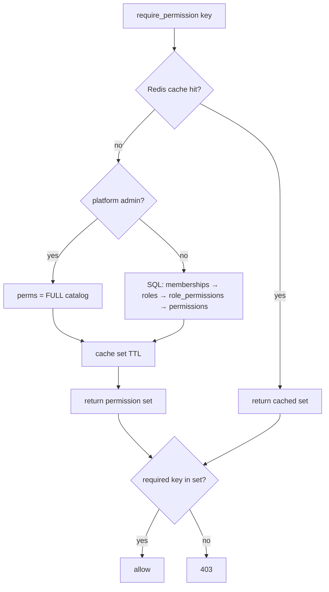
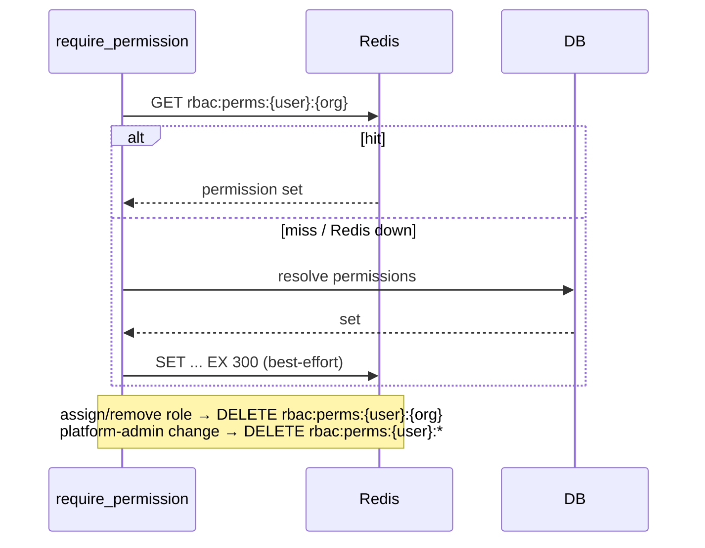
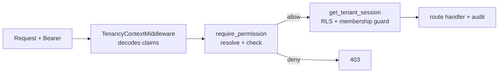

# RBAC Authorization (Sprint 2 · S2-T5)

Permission-based authorization over the role/permission model from S2-T1. Routes check **permissions**,
never role names. Effective permissions are resolved from the database, cached in Redis, and the
provisioning key is replaced by the `org:provision` permission held by platform Super Admins.

## Components

| Concern | Location |
|---|---|
| Permission catalog + resolution + platform registry | `rbac/repository.py` |
| Effective-permission resolution, role admin, platform admin (+ audit) | `rbac/service.py` |
| Redis cache (best-effort, DB fallback) | `rbac/cache.py` |
| `require_permission` / `require_platform_permission` | `rbac/deps.py` |
| Catalog, role admin, assignment, platform-admin APIs | `rbac/router.py` |
| Platform-admin table | `alembic/versions/0007_rbac.py` |

## Permission resolution flow

Resolution unions permissions across **all** of a user's roles in the active org (system + custom →
`role_permissions` → `permissions`), so a user with multiple roles inherits the union. Platform admins
resolve to the full catalog — that is how Super Admin authorization stays permission-based rather than a
name check. Resolution runs on the privileged session with explicit `(user, org)` filters, so it is
independent of request RLS state.

## Cache flow

Keys are `rbac:perms:{user_id}:{scope}` where scope is an org id or `platform`; TTL is
`rbac_cache_ttl_seconds` (300s). **Every cache call is wrapped** — if Redis is unavailable the lookup
misses and authorization falls back to the database, so a cache outage degrades performance, never
security. Writes invalidate the affected key immediately, so permission changes take effect at once
rather than waiting for TTL.

## Authorization flow

Tenant routes declare both `require_permission(key)` (authorization, privileged resolution) and
`get_tenant_session` (RLS write context). The permission gate runs first; only on success does the
handler open the tenant session and perform the write. Route → permission mapping:

| Permission | Routes |
|---|---|
| `org:read` | GET org, GET settings |
| `org:update` | PATCH org, PATCH settings, close |
| `users:read` | list/get members, list invitations |
| `users:update` | update member status |
| `users:remove` | remove member |
| `users:invite` | create/revoke invitations |
| `roles:read` | permission catalog, list roles, list member roles |
| `roles:manage` | create role, assign/remove member roles |
| `org:provision` (platform) | provision org, manage platform admins |

`leave` and the identity routes (create-your-own-org, accept invite, profile) require only
authentication — they are self-service and need no org permission.

## Super Admin & provisioning

A **platform admin** (`platform_admins` row) resolves to the full catalog at both org and platform
scope. The provisioning endpoint dropped its `X-Provisioning-Key` and now requires
`require_platform_permission("org:provision")`, which only platform admins satisfy. The first admin is
bootstrapped keylessly: set `BOOTSTRAP_SUPERADMIN_EMAIL`, and on startup that user (if present) is
promoted idempotently; subsequent admins are managed through `/admin/platform-admins`.

## Audit integration

Every assignment change writes an append-only `audit_logs` row via the same session as the change (so
the org-scoped RLS `WITH CHECK` is satisfied):

| Action | When | Scope |
|---|---|---|
| `role.assigned` / `role.removed` | member role assign / remove | org |
| `role.created` | custom role created | org |
| `platform_admin.granted` / `revoked` | platform-admin change | platform (org NULL) |
| `platform_admin.bootstrapped` | startup promotion | platform (org NULL) |

Each row records actor, target, and ids in `metadata` (jsonb). The `audit_logs` immutability trigger
blocks any later UPDATE/DELETE, so the role-change history cannot be rewritten.

## Rules honored

Never checks role names — only permission keys ✓; permissions come from the DB ✓; system + custom roles
✓; multiple roles per user (union) ✓; inheritance through roles ✓; Redis cache with invalidation ✓; all
role-assignment changes audited ✓.

## Verification

**20/20** RBAC e2e against live PostgreSQL + Redis: Org Admin/Manager/custom resolution, authorized
write (200) vs unauthorized (403), catalog ≥ 11, system+custom roles, new member has no perms,
assign→perms appear (cache invalidation), remove→perms gone, custom role grants its perms, provision
without platform perm → 403, platform admin can provision → 201 and holds all perms, and
`role.assigned/removed/created` audit rows. Regression green: auth 18/18 (two provisioning checks
updated for the key→permission change), tenancy 11/11, orgs 19/19, RLS suite 34/34, unit 2/2.
