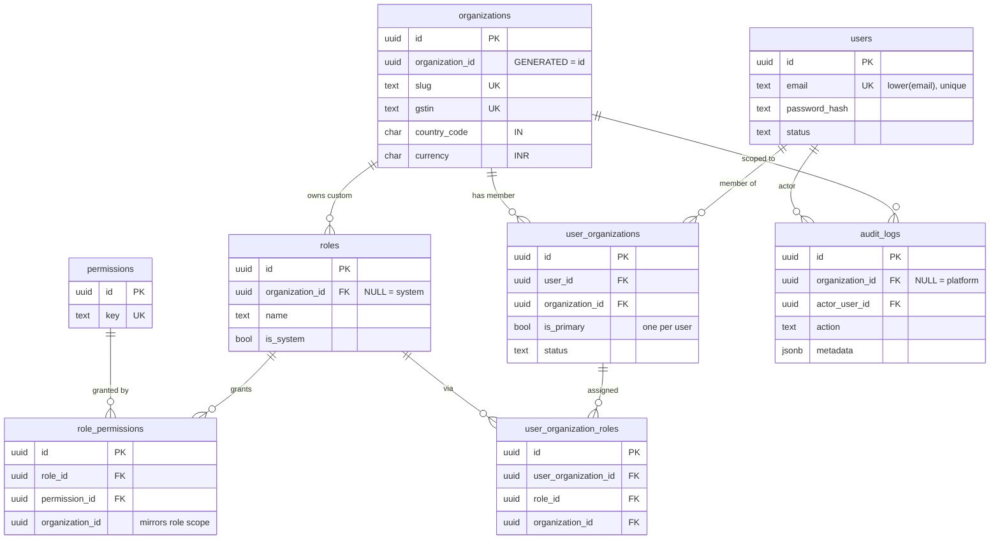

# Secure-Core Schema (Sprint 2 · S2-T1)

Database layer for the secure core. Eight tables, delivered by two migrations:
`0002_secure_core` (structure + RLS) and `0003_seed_rbac` (idempotent system data).

## Entity–relationship

## Tenancy classification

| Table | Scope | RLS | Notes |
|---|---|---|---|
| `users` | **Global** | none | Shared identity; no `organization_id` (per architecture). |
| `permissions` | **Global** | none | Static platform catalog. |
| `organizations` | Org root | **org_isolation** | Generated `organization_id = id` ⇒ an org sees only itself. |
| `user_organizations` | Org | **org_isolation** | The membership = tenant boundary. |
| `user_organization_roles` | Org | **org_isolation** | Role assignment within a membership. |
| `audit_logs` | Org | **org_isolation** | Append-only; `organization_id NULL` = platform event (bypass only). |
| `roles` | Hybrid | **org_isolation + system-readable** | `organization_id NULL` = system (shared); else org-custom. |
| `role_permissions` | Hybrid | **org_isolation + system-readable** | Mirrors role scope. |

Every table carries the standard envelope — UUIDv7 `id`, `created_at`, `updated_at` (trigger-maintained),
`created_by`, `updated_by`, `deleted_at` (soft delete), `version` (optimistic lock) — **except
`audit_logs`**, which is immutable and therefore omits `updated_*`, `deleted_at`, and `version`.

## Seed strategy (`0003_seed_rbac`, idempotent)

- **Permissions** (11): `org:{read,update,provision,suspend}`, `users:{read,invite,update,remove}`,
  `roles:{read,manage}`, `audit:read`. Inserted with `WHERE NOT EXISTS` on the natural `key`.
- **System roles** (4, `organization_id NULL`): Super Admin, Org Admin, Manager, Member.
- **Mappings** (28): Super Admin → all 11; Org Admin → 9; Manager → 5; Member → 3.
- **Idempotent**: every insert guards with `WHERE NOT EXISTS` on natural keys, so re-running is a no-op.
- **RLS handling**: `roles`/`role_permissions` are RLS-FORCEd, so the migration briefly toggles RLS off
  around the `NULL`-org system inserts (runs single-threaded as table owner), then re-enables + re-forces.
  `permissions` is global and seeded directly.

## RLS integration points

1. **Policy source** — every org-scoped table calls `app.enable_org_rls()` (from `0001`) **in the same
   migration that creates it**, yielding `USING / WITH CHECK (organization_id = app.current_org_id())`
   with `ENABLE` + `FORCE`.
2. **Context** — `app.current_org_id()` reads the request GUC set from the JWT active-org claim
   (wired in S2-T3). No context ⇒ `NULL` ⇒ zero rows (fail-closed).
3. **Tenant root** — `organizations.organization_id` is generated `= id`, so the uniform policy makes an
   org see only its own record.
4. **Hybrid sharing** — `roles`/`role_permissions` add a permissive `FOR SELECT USING
   (organization_id IS NULL)` policy so every tenant can read shared system rows while custom rows stay
   isolated. `WITH CHECK` still forbids tenants from creating `NULL`-org (system) rows.
5. **Append-only audit** — `audit_logs` grants `app_user` only `SELECT, INSERT`, and a
   `BEFORE UPDATE OR DELETE` trigger (`app.deny_mutation`) blocks mutation even for privileged roles.
6. **Provisioning paths** — inserting a new organization (self-service registration / Super-Admin
   provisioning) runs under the BYPASSRLS role or a privileged routine, because `WITH CHECK` cannot be
   satisfied before the org's own context exists. This is an auth-layer concern (S2-T2), not schema.

## Harness coverage (added this task)

`backend/tests/integration/test_rls_secure_core.py` extends the RLS suite to the real tables:
organizations isolation + self-only root, membership isolation, audit isolation + append-only,
fail-closed on missing context, cross-tenant insert rejection, and the hybrid roles invariant
(system shared, custom isolated, tenants cannot mint system roles). **34/34** integration tests pass.
