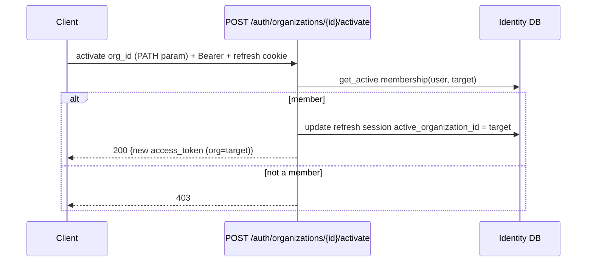

# Tenancy Context Wiring (Sprint 2 · S2-T3)

Turns the signed active-org claim into per-request RLS context, guards tenant routes by membership, and
re-mints the JWT on org switch. **The active org is taken only from the JWT** — never from a header,
query parameter, or request body.

## Generated / updated files

| File | Role |
|---|---|
| `app/modules/tenancy/middleware.py` | Request middleware — decodes the token once → `request.state` |
| `app/modules/tenancy/deps.py` | Tenant guard + DB context injection (`get_tenant_session`) |
| `app/modules/tenancy/context.py` | `TenantContext` value object |
| `app/modules/tenancy/router.py` | Demonstrator tenant route (`GET /tenancy/context`) |
| `app/modules/auth/router.py` | `POST /auth/organizations/{id}/activate` (org switch) |
| `app/modules/auth/service.py` | `switch_active_org`; refresh now preserves the active org |
| `app/modules/auth/repository.py` | `update_active_org`, membership `get_active` |
| `app/modules/auth/tokens.py` | `AccessClaims` (typed JWT contract) |
| `alembic/versions/0005_tenancy.py` | `auth_refresh_tokens.active_organization_id` (switch continuity) |
| `app/main.py` | Middleware added to the request lifecycle |

## JWT model (access token)

`sub` (user id) · `org` (active organization id) · `jti` · `type=access` · `iat` · `exp`. The `org`
claim is authoritative for tenant context and is only ever set by login/register/refresh/switch — all of
which validate membership first.

## Request flow (tenant route)

```mermaid
sequenceDiagram
    participant C as Client
    participant MW as TenancyContextMiddleware
    participant Dep as get_tenant_session
    participant DB as Postgres (app_user, RLS)
    C->>MW: GET /tenancy/context (Bearer access)
    MW->>MW: decode token → request.state.auth_claims (org claim)
    MW->>Dep: continue
    Dep->>DB: SELECT set_config('app.current_org_id', org, true)
    Dep->>DB: SELECT 1 FROM user_organizations WHERE user_id=me (under RLS)
    alt active member of active org
        Dep-->>C: route runs; queries see ONLY the active org
    else not a member / revoked
        Dep-->>C: 403
    end
    Note over MW,Dep: no token → 401
```

## Org-switch flow



The target org comes from the **URL path**, never the body/header/query, so it cannot be smuggled into
tenant data access. Switching mints a **new access token** and persists the active org on the refresh
session, so it survives subsequent refreshes (proven: switch → refresh keeps the new org).

## Database context flow

1. `get_tenant_session` opens an `app_user` (RLS-enforced) session and runs
   `set_config('app.current_org_id', <org>, true)` — transaction-local, read by `app.current_org_id()`.
2. The whole request runs in **one transaction**, so the context holds for every query and resets on
   commit/rollback — safe under connection pooling (no cross-request leakage).
3. Every `org_isolation` policy resolves `organization_id = app.current_org_id()`, so tenant queries see
   only the active org's rows. Auth/identity work continues on the separate BYPASSRLS session.

## Membership validation

Validated in two places: at **switch time** (before minting) and on **every tenant request** (via the
guard), so a membership revoked after the token was issued is rejected on the next request — confirmed
by test (revoke → 403). The per-request check is enforced *through RLS itself*: under the org context,
the membership row is visible only to an active member of that org.

## Security protections

- Active org is read **only** from the signed JWT — headers, query, and body are never trusted for it.
- Switch target is a **path parameter** behind membership validation; it cannot widen data access on its
  own (RLS still gates every row).
- DB context is **transaction-local** and set per request → no leakage across pooled connections.
- Tenant routes require a valid token (**401**) and active membership in the active org (**403**).
- Membership is re-validated per request, so **revocation takes effect immediately**.

## Verification

End-to-end against live PostgreSQL — **11/11 checks**: context returns only the active org under each
token, no-token → 401, switch mints a new org-scoped JWT (path param), context follows the switch,
switching to a non-member org → 403, refresh preserves the switched org, and a revoked membership →
403. The auth e2e (18), RLS suite (34), and unit tests remain green.
