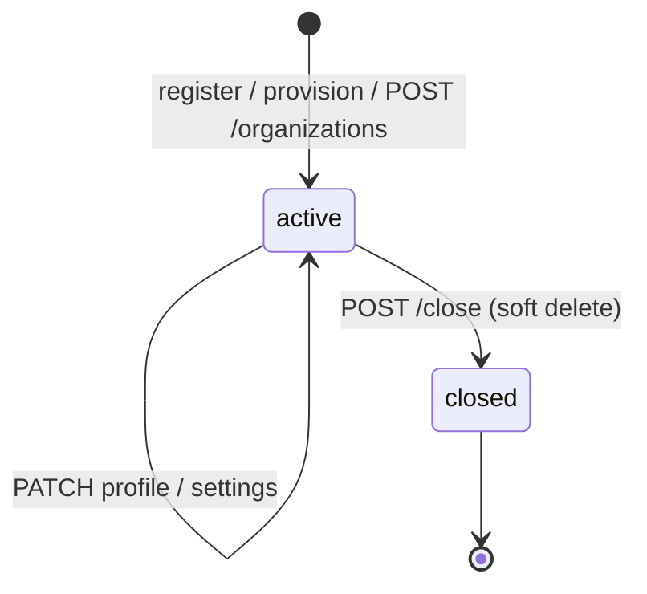
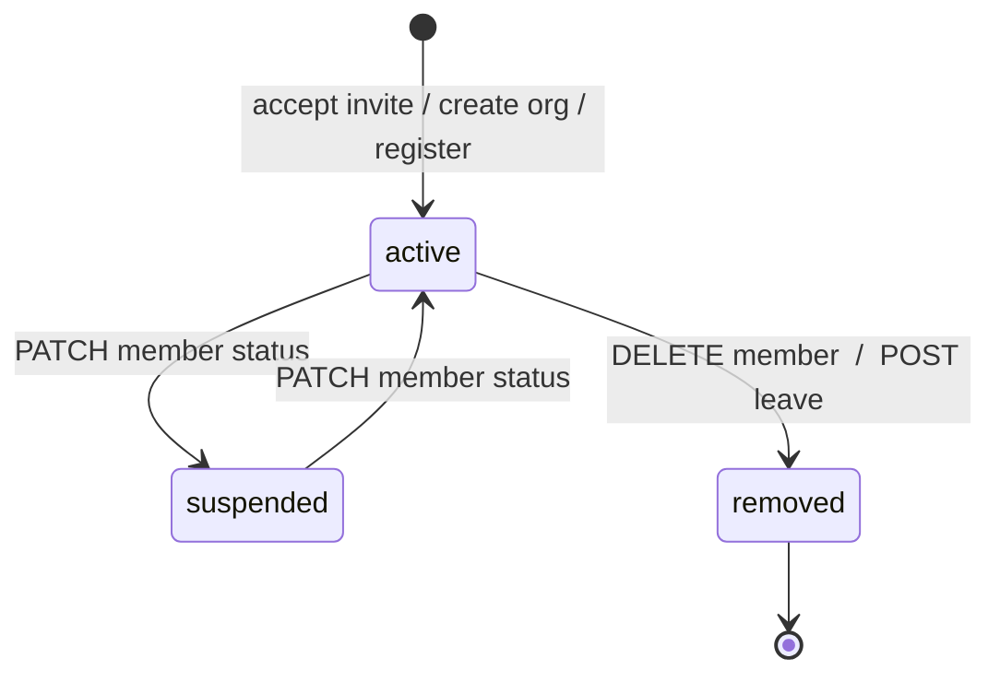

# Users & Organizations Module (Sprint 2 · S2-T4)

Tenant-scoped CRUD over the existing tenancy context (RLS), auth, and the membership guard. **No RBAC
enforcement** — any authenticated active member can perform these; permissions arrive in S2-T5.

## Plane split

- **Tenant plane** (`get_tenant_session`: RLS + membership guard, org context already set) — everything
  scoped to the active org: org profile/settings, members, invitations.
- **Identity plane** (auth session) — actions that span orgs or precede membership: create another org,
  list my orgs, invitation preview/accept, user profile.

## Endpoints

| Method | Path | Plane | Purpose |
|---|---|---|---|
| GET | `/organizations/current` | tenant | Active org profile |
| PATCH | `/organizations/current` | tenant | Update profile (name, GSTIN, contact, address) |
| GET | `/organizations/current/settings` | tenant | Read settings bag |
| PATCH | `/organizations/current/settings` | tenant | Merge settings |
| POST | `/organizations/current/close` | tenant | Soft-close the org |
| GET | `/organizations/current/members` | tenant | List members |
| GET | `/organizations/current/members/{user_id}` | tenant | Get member |
| PATCH | `/organizations/current/members/{user_id}` | tenant | Update membership status |
| DELETE | `/organizations/current/members/{user_id}` | tenant | Remove a member |
| POST | `/organizations/current/leave` | tenant | Leave the active org |
| POST | `/organizations/current/invitations` | tenant | Invite by email |
| GET | `/organizations/current/invitations` | tenant | List pending invitations |
| DELETE | `/organizations/current/invitations/{id}` | tenant | Revoke an invitation |
| POST | `/organizations` | identity | Create another organization (becomes a member) |
| GET | `/organizations` | identity | List my organizations |
| GET | `/invitations/{token}` | identity | Preview an invitation |
| POST | `/invitations/{token}/accept` | identity | Accept → join |
| GET | `/users/me` | identity | My profile |
| PATCH | `/users/me` | identity | Update my profile |

## Organization lifecycle



Creation happens via auth (register/provision) or `POST /organizations` for an existing user; the row is
the RLS tenant root (an org sees only itself), and update/close operate on the active org under RLS.

## Invitation flow

```mermaid
sequenceDiagram
    participant A as Member (active org)
    participant API
    participant I as Invitee
    A->>API: POST /organizations/current/invitations {email}
    Note over API: reject if already a member or a pending invite exists
    API-->>A: 201 (link logged; emailed later)
    I->>API: GET /invitations/{token}  (preview)
    I->>API: POST /invitations/{token}/accept  (authenticated)
    Note over API: token pending & unexpired; invitee email must match
    API->>API: create membership (+ optional role); mark invite accepted
    API-->>I: 200 — joined
```

Validation: one pending invite per email per org (DB partial-unique + service check), 7-day expiry,
single-use, token stored only as a hash, and the accepting user's email must match the invite.

## Membership flow



Guards: you cannot remove yourself via the member endpoint (use leave); the **last active member**
cannot be removed or leave (the org would be orphaned — close it instead). All membership reads/writes
run under RLS, so they only ever touch the active org.

## Rules honored

- Uses the existing tenancy context and RLS policies (tenant routes go through `get_tenant_session`).
- Uses the existing auth system (identity actions via the auth session + `get_current_user`).
- No RBAC enforcement; no frontend.
- The org-switch rule still holds — nothing here reads an org id from header/query/body for context;
  member/invitation ids are path params, and the active org always comes from the JWT.

## Verification

End-to-end against live PostgreSQL — **19/19 checks**: profile read/update (GSTIN validated, bad GSTIN →
422), settings merge, member listing, invite create + duplicate guard, preview, accept (wrong email →
422), join (member count grows), leave, last-member-leave guard (409), create-another-org, list-my-orgs,
profile update. Auth (18), tenancy (11), RLS suite (34), and unit (2) remain green.
